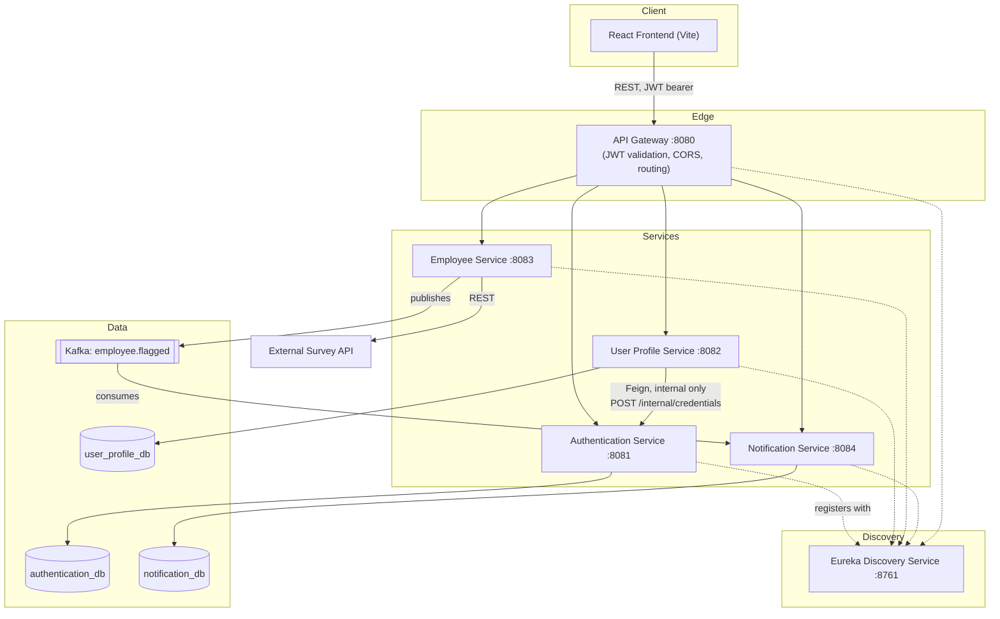
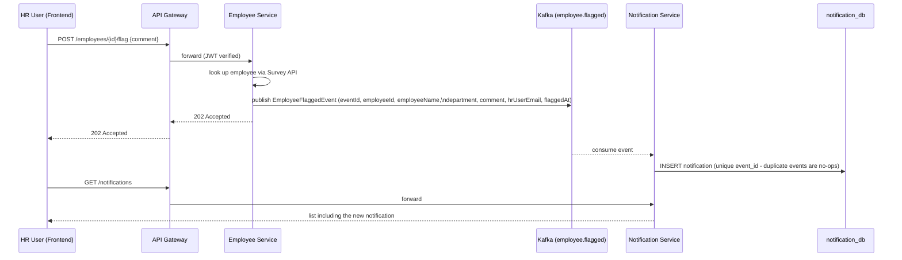

# Attrition Analyzer

A microservices-based HR analytics application for exploring employee attrition. HR users log in to search employee records, view six dimensions of attrition analysis, and flag at-risk employees with a comment that other HR users can see as a notification. Unauthenticated **Guests** can view a limited attrition summary and register to become an HR user.

Employee data is not stored by this application — it is retrieved live from an external **Survey API** that acts as the system of record.

> **Source of truth:** this README was written by inspecting the actual repository (code, `docker-compose.yml`, `pom.xml`/`package.json` files, Spring Security configs, and tests) as of the current `main` branch — not by copying the original planning documents. Where the original plan (`docs/technical-plan.md`) differs from what was actually built, this README describes what was built.

---

## Table of Contents

<!-- 1. [Project Overview](#project-overview) -->
2. [Features / User Stories (US-01–US-21)](#features--user-stories-us-01us-21)
3. [System Architecture](#system-architecture)
4. [Technology Stack](#technology-stack)
5. [Repository Structure](#repository-structure)
6. [Prerequisites](#prerequisites)
7. [Environment Variables & `.env` Setup](#environment-variables--env-setup)
8. [Database Setup](#database-setup)
9. [Kafka Setup](#kafka-setup)
10. [Docker Setup](#docker-setup)
11. [Running the Project From Scratch](#running-the-project-from-scratch)
12. [Ports Reference](#ports-reference)
13. [Authentication, JWT, and HR vs. Guest Access](#authentication-jwt-and-hr-vs-guest-access)
14. [API Endpoints & Gateway Usage](#api-endpoints--gateway-usage)
15. [Testing](#testing)
16. [End-to-End Manual Verification Flow](#end-to-end-manual-verification-flow)
17. [Troubleshooting](#troubleshooting)
18. [Project Development Plan](#project-development-plan)
19. [Future Improvements](#future-improvements)

---

## Project Overview

Attrition Analyzer helps HR teams answer "who is likely to leave, and why?" without spreadsheets. It's built as six independent Spring Boot microservices behind a single API Gateway, backed by Eureka service discovery, MySQL (one private database per service that needs one), and Kafka for one specific asynchronous flow (flagging an employee → creating a notification). The frontend is a React + Vite single-page app that talks **only** to the Gateway.

There are exactly two user types:

- **Guest** — no account. Can view a limited attrition summary (department + job role) and can register to become an HR User. Cannot see individual employee records, search, employee details, or notifications.
- **HR User** — full access: employee directory, search, employee details, all six attrition analyses, flagging employees, and notifications.

---
<!-- 
## Features / User Stories (US-01–US-21)

Per the finalized 21-story product backlog (`docs/Attrition_Analyzer_Product_Backlog_Corrected.xlsx`), grouped by epic. Status reflects the **actual current implementation**, verified against the code.

### Account & Authentication

| ID | Story | Status | Notes |
|---|---|---|---|
| US-01 | Register as HR User | ✅ Implemented | `POST /users/register` (User Profile Service, internally hands off to Authentication Service) |
| US-02 | HR Login | ✅ Implemented | `POST /auth/login` returns a JWT |
| US-03 | HR Logout | ✅ Implemented | `POST /auth/logout` exists server-side for completeness; since JWTs are stateless there's nothing to invalidate server-side, so the frontend simply discards the token locally and doesn't call this endpoint |
| US-04 | Reset HR Password | ⚠️ Backend only | `POST /auth/reset-password/request` and `/confirm` exist and are tested; **no frontend UI page calls them yet** |
| US-05 | Session Timeout | ✅ Implemented | JWT `exp` claim (1 hour by default); frontend auto-logs-out on expiry and on any `401` from a protected call |
| US-06 | View HR Profile | ✅ Implemented | `GET /users/me` |
| US-07 | Update HR Profile | ✅ Implemented | `PUT /users/me` |

### Employee Data

| ID | Story | Status | Notes |
|---|---|---|---|
| US-08 | View Employee Records | ✅ Implemented | `GET /employees` |
| US-09 | Search Employee Information | ✅ Implemented | `GET /employees?property=X&value=Y` (exact-match single field, server-side); the frontend directory search/filter is client-side over the fetched list |
| US-10 | View Employee Details | ✅ Implemented | `GET /employees/{id}` |

### Attrition Analysis

| ID | Story | Status | Endpoint |
|---|---|---|---|
| US-11 | Attrition by Department | ✅ Implemented | `GET /employees/analysis/department` |
| US-12 | Attrition by Job Role | ✅ Implemented | `GET /employees/analysis/job-role` |
| US-13 | Attrition by Compensation | ✅ Implemented | `GET /employees/analysis/compensation` |
| US-14 | Attrition by Demographics | ✅ Implemented | `GET /employees/analysis/demographics` |
| US-15 | Attrition by Work-Life Balance | ✅ Implemented | `GET /employees/analysis/work-life-balance` |
| US-16 | Attrition by Career Progression | ✅ Implemented | `GET /employees/analysis/career-progression` |

### Notifications

| ID | Story | Status | Notes |
|---|---|---|---|
| US-17 | Create Employee Notification | ✅ Implemented | Via "Flag Employee" — `POST /employees/{id}/flag`, which publishes a Kafka event that Notification Service consumes and turns into a notification |
| US-18 | Add Comment to Notification | ✅ Implemented | The comment is a field on the same flag action (no separate comment endpoint) |
| US-19 | View My Notifications | ✅ Implemented | `GET /notifications` (returns only the caller's own notifications) |
| US-20 | Delete My Notification | ✅ Implemented | `DELETE /notifications/{id}` |

A direct `POST /notifications` endpoint also exists on Notification Service (bypassing the Kafka flow) and is covered by tests, but no frontend action currently calls it — the UI's only creation path is "Flag Employee."

### Guest Experience

| ID | Story | Status | Notes |
|---|---|---|---|
| US-21 | Explore Attrition Info as Guest | ✅ Implemented | Gateway `permitAll`s `GET /employees/analysis/**` only; `/employees`, `/employees/{id}`, and `/notifications/**` all require a JWT. The public landing page shows department + job-role attrition without login |

--- -->

## System Architecture



### Service Responsibilities

| Service | Owns | Talks to |
|---|---|---|
| **discovery-service** | Eureka registry only | Every other service registers with it |
| **api-gateway** | Routing, CORS, JWT validation (verify-only) | Routes to all four business services by name via Eureka |
| **authentication-service** | `authentication_db` (credentials, hashed passwords, role) | Issues/validates JWTs; exposes an **internal-only** `POST /internal/credentials` consumed via Feign, never through the Gateway |
| **user-profile-service** | `user_profile_db` (name, email, phone) | Calls authentication-service via Feign during registration to create the credential first |
| **employee-service** | No database — reads live from the external Survey API | Publishes `employee.flagged` Kafka events when an employee is flagged |
| **notification-service** | `notification_db` (flagged-employee notifications + comments) | Consumes `employee.flagged` from Kafka; idempotent on `event_id` |

### Employee → Notification (Kafka) Flow



---

## Technology Stack

| Layer | Technology | Version |
|---|---|---|
| Language / Runtime | Java | 21 |
| Application Framework | Spring Boot | 4.0.8 |
| Microservices / Cloud | Spring Cloud (Eureka, Gateway MVC, OpenFeign) | 2025.1.3 |
| Security | Spring Security + JWT (`jjwt` 0.12.6) | — |
| Persistence | Spring Data JPA + MySQL | MySQL 8.0 |
| Messaging | Apache Kafka (KRaft mode, no ZooKeeper) | `apache/kafka:3.9.0` |
| Build | Maven (via `mvnw` wrapper, per service) | — |
| Frontend | React 19 + TypeScript + Vite | Vite 8 |
| Frontend styling | Tailwind CSS 4 | — |
| Frontend routing | React Router | 7 |
| Containerization | Docker / Docker Compose | — |

---

## Repository Structure

```
attrition-analyzer/
├── discovery-service/           # Eureka service registry
├── api-gateway/                 # Single entry point, JWT validation, CORS, routing
├── authentication-service/      # Credentials, login, JWT issuance (MySQL: authentication_db)
├── user-profile-service/        # HR profile data, registration (MySQL: user_profile_db)
├── employee-service/            # Employee records, search, 6 attrition analyses, flagging (no DB)
├── notification-service/        # Notifications, Kafka consumer (MySQL: notification_db)
├── frontend/                    # React + Vite + TypeScript SPA
├── docker/
│   └── mysql/init-databases.sh  # NOT used by docker-compose.yml (see Troubleshooting) - leftover from an earlier single-shared-MySQL design
├── docs/
│   ├── diagrams/                 # Reference diagrams, including the dashboard design inspiration image
│   ├── project-flow.md           # Mermaid diagrams of major flows
│   ├── technical-plan.md         # Original story-to-service planning document (see note below)
│   └── Attrition_Analyzer_Product_Backlog_Corrected.xlsx
├── docker-compose.yml
├── .env.example                  # Copy to .env and fill in
├── CLAUDE.md                     # Project rules/conventions for AI-assisted development
└── README.md
```

Each service directory is an **independent** Spring Boot Maven project (own `pom.xml`, `mvnw`/`mvnw.cmd`, `src/`) — this is not a multi-module build.

> **Note on `docs/technical-plan.md`:** it's the original pre-implementation plan and its proposed endpoint names differ from what was actually built (e.g., it proposes `POST /auth/register` and `GET/PUT /users/profile`; the real implementation uses `POST /users/register` and `GET/PUT /users/me`, and Guest access is a Gateway `permitAll` rule rather than a separate `/public/*` route). Treat this README and the code as authoritative for endpoints; the technical plan is useful for the story-to-epic rationale and phased build order.

---

## Prerequisites

| Tool | Version | Needed for |
|---|---|---|
| JDK | 21 | Building/running any backend service |
| Maven | (or use the bundled `mvnw`/`mvnw.cmd` — no separate install needed) | Backend builds |
| Node.js | LTS (Node 18+) | Frontend |
| npm | bundled with Node | Frontend |
| Docker + Docker Compose | recent | Running the full stack (MySQL ×3, Kafka, all 6 services) |
| An external Survey API | reachable at the URL you configure | Employee Service has no data of its own — see below |

**About the Survey API:** Employee Service is stateless with respect to employee data — every request is proxied to an external Survey API. By default it points at `http://localhost:3232` (or `http://host.docker.internal:3232` inside Docker). You must have a Survey API instance (from the case study this project is based on) running and reachable at that address, or override `survey-api.base-url` / the Docker Compose `-Dsurvey-api.base-url` value to point at wherever yours runs. Nothing in this repository starts a Survey API for you.

---

## Environment Variables & `.env` Setup

Copy the template and fill in real values — `.env` is git-ignored, `.env.example` is committed with blank placeholders:

```bash
cp .env.example .env
```

`.env.example` (verbatim, as committed):

```dotenv
# Copy this file to .env and fill in real values. .env is git-ignored.

# Shared root password for the authentication-db and user-profile-db containers
MYSQL_ROOT_PASSWORD=

# authentication-service / authentication-db (docker-compose)
AUTH_DB_USERNAME=
AUTH_DB_PASSWORD=

# user-profile-service / user-profile-db (docker-compose)
PROFILE_DB_USERNAME=
PROFILE_DB_PASSWORD=

# notification-service / notification-db (docker-compose)
NOTIFICATION_DB_ROOT_PASSWORD=
NOTIFICATION_DB_USERNAME=
NOTIFICATION_DB_PASSWORD=

# Shared secret used to sign/verify JWTs (Authentication Service issues them,
# Notification Service verifies them) - must be the same value both services use.
JWT_SECRET=
```

| Variable | Used by | Purpose |
|---|---|---|
| `MYSQL_ROOT_PASSWORD` | `authentication-db`, `user-profile-db` | Root password for those two MySQL containers (they share one value) |
| `AUTH_DB_USERNAME` / `AUTH_DB_PASSWORD` | `authentication-db`, `authentication-service` | App-level DB credentials for `authentication_db` |
| `PROFILE_DB_USERNAME` / `PROFILE_DB_PASSWORD` | `user-profile-db`, `user-profile-service` | App-level DB credentials for `user_profile_db` |
| `NOTIFICATION_DB_ROOT_PASSWORD` | `notification-db` | Root password for that container (kept separate from the other two by design) |
| `NOTIFICATION_DB_USERNAME` / `NOTIFICATION_DB_PASSWORD` | `notification-db`, `notification-service` | App-level DB credentials for `notification_db` |
| `JWT_SECRET` | `authentication-service` (signs), `api-gateway`/`user-profile-service`/`notification-service` (verify) | **Must be identical across every service.** Use a long random string in real environments |

Not in `.env.example` but has a safe default if omitted — `JWT_EXPIRATION_MS` (Authentication Service, default `3600000` = 1 hour). Set it explicitly only if you want a different session length.

The frontend needs no `.env` file for local development — it defaults to `http://localhost:8080` for the Gateway. To point it elsewhere, set `VITE_API_BASE_URL` (e.g. in `frontend/.env.local`, which Vite loads automatically and is git-ignored).

**Never commit `.env` or real secrets.** Use placeholders like the ones above in any shared documentation.

---

## Database Setup

Each service that needs a database owns a **private** MySQL 8.0 database — no service reads another's tables directly.

| Database | Container | Host port → 3306 | Owner service |
|---|---|---|---|
| `authentication_db` | `authentication-db` | `3308` | authentication-service |
| `user_profile_db` | `user-profile-db` | `3309` | user-profile-service |
| `notification_db` | `notification-db` | `3307` | notification-service |

Databases and app-level users are created automatically by the official `mysql:8.0` image's entrypoint, using `MYSQL_DATABASE` / `MYSQL_USER` / `MYSQL_PASSWORD` from your `.env` — you don't need to run any SQL by hand for the Docker path. Data persists in named Docker volumes (`authentication-db-data`, `user-profile-db-data`, `notification-db-data`).

Key tables (see each service's JPA entities for the full schema):

| Table | Service | Notable columns |
|---|---|---|
| `credentials` | authentication-service | `user_id` (UUID, PK), `email`, `password_hash` (BCrypt), `role` (`HR` — the only stored role; Guest is unauthenticated, not a row), `created_at` |
| `user_profiles` | user-profile-service | `user_id` (UUID, PK — same UUID as `credentials`), `full_name`, `email`, `phone`, `created_at`, `updated_at` |
| `notifications` | notification-service | `id`, `employee_id`, `employee_name`, `department`, `hr_user_email`, `comment`, `event_id` (unique — Kafka idempotency key), `created_at` |

Employee Service has **no database** — US-08 through US-16 all compute live against whatever the Survey API returns.

---

## Kafka Setup

A single-broker Kafka cluster runs in **KRaft mode** (no ZooKeeper), defined in `docker-compose.yml` using the `apache/kafka:3.9.0` image, exposed on host port `9092`.

| Setting | Value |
|---|---|
| Topic | `employee.flagged` |
| Producer | employee-service |
| Consumer | notification-service (consumer group `notification-service`) |
| Idempotency key | `eventId` (UUID) — enforced by a unique DB constraint on `notifications.event_id`; duplicate deliveries of the same event are silently ignored, not double-inserted |
| Bootstrap servers (Docker) | `kafka:9092` |
| Bootstrap servers (local/non-Docker default) | `localhost:9092` |

**Event schema** (`EmployeeFlaggedEvent`, published as JSON, no type headers — the consumer has its own copy of the class in its own package):

```json
{
  "eventId": "uuid",
  "employeeId": "string",
  "employeeName": "string",
  "department": "string",
  "comment": "string",
  "hrUserEmail": "string",
  "flaggedAt": "2026-01-01T00:00:00Z"
}
```

**Flow:** an HR user calls `POST /employees/{id}/flag` with a comment → Employee Service looks the employee up via the Survey API → publishes one `EmployeeFlaggedEvent` to `employee.flagged` → Notification Service consumes it and inserts a notification (or no-ops if that `eventId` already exists) → the HR user (any HR user — notifications aren't currently scoped per-flagger beyond `hr_user_email`) sees it via `GET /notifications`.

No manual topic creation is required — `notification.kafka.topic=employee.flagged` is configured on both services' `application.properties`, and the broker auto-creates the topic on first publish.

---

## Docker Setup

`docker-compose.yml` at the repo root defines 10 services: `discovery-service`, `api-gateway`, `employee-service`, `kafka`, `authentication-db`, `authentication-service`, `user-profile-db`, `user-profile-service`, `notification-db`, `notification-service` — all on one bridge network, `attrition-net`.

Each backend service has a minimal `Dockerfile` of this shape (they package a pre-built jar — **they do not run Maven themselves**):

```dockerfile
FROM eclipse-temurin:21-jre
WORKDIR /app
RUN useradd --uid 1001 appuser
COPY target/*.jar app.jar
USER appuser
EXPOSE <service port>
ENTRYPOINT ["sh", "-c", "java $JAVA_OPTS -jar app.jar"]
```

This means **you must build the jar with `mvnw package` before `docker compose build`** for any service you've changed — the Dockerfile has nothing to compile from otherwise.

Health-checked dependencies use `depends_on: condition: service_healthy` (all 3 MySQL containers and Kafka) so dependent services wait for a real health check, not just "container started," avoiding cold-start races.

The frontend is **not** included in `docker-compose.yml` — it's a separate Vite dev server / static build, run independently (see below).

---

## Running the Project From Scratch

This is the exact path: clone → configure → Docker → databases → Kafka → backend → frontend → login → use → test → stop.

### 1. Clone and configure

```bash
git clone <this-repo-url>
cd attrition-analyzer
cp .env.example .env
# edit .env and fill in every value (see Environment Variables above)
```

### 2. Build every backend service's jar

Each service is built independently:

```bash
for svc in discovery-service api-gateway authentication-service user-profile-service employee-service notification-service; do
  (cd "$svc" && ./mvnw -q -DskipTests package)
done
```

(Windows PowerShell: replace `./mvnw` with `.\mvnw.cmd`, and loop with `foreach`.)

### 3. Start the full stack (Docker Compose)

```bash
docker compose up -d --build
```

This builds all 6 service images from the jars you just packaged, starts the 3 MySQL containers and Kafka, waits for their health checks, then starts the dependent services. First cold start can take 1–2 minutes for MySQL/Kafka to become healthy.

Watch it come up:

```bash
docker compose ps
docker compose logs -f api-gateway
```

### 4. Verify the backend is up

- Eureka dashboard: http://localhost:8761 — all 5 services (discovery, gateway, auth, profile, employee, notification) should show as registered instances.
- Gateway health: `curl http://localhost:8080/actuator/health`

### 5. Point Employee Service at your Survey API

Employee Service needs a reachable Survey API (see [Prerequisites](#prerequisites)). If yours isn't at the default `host.docker.internal:3232`, edit the `employee-service` service's `-Dsurvey-api.base-url` in `docker-compose.yml` and re-run `docker compose up -d --build employee-service`.

### 6. Run the frontend

```bash
cd frontend
npm install
npm run dev
```

Open the printed local URL (Vite's default is `http://localhost:5173`). No `.env` needed — it talks to `http://localhost:8080` by default.

### 7. Log in / register / use it

- Visit `/` — the Guest-visible attrition summary loads without logging in.
- Register a new HR account, or log in if you already have one.
- Explore the dashboard, employee directory, employee details, flag an employee, see the notification appear, delete it.

### 8. Run tests (optional but recommended)

See [Testing](#testing) below.

### 9. Stop everything

```bash
docker compose down          # stop + remove containers, keep DB volumes
docker compose down -v       # also wipe DB volumes (destructive - fresh start)
```

---

## Ports Reference

| Service / Container | Port (host) | Protocol |
|---|---|---|
| Frontend (Vite dev server) | `5173` (Vite default; not fixed in config) | HTTP |
| API Gateway | `8080` | HTTP |
| Authentication Service | `8081` | HTTP |
| User Profile Service | `8082` | HTTP |
| Employee Service | `8083` | HTTP |
| Notification Service | `8084` | HTTP |
| Eureka Discovery Service | `8761` | HTTP |
| Kafka broker | `9092` | Kafka protocol |
| `notification-db` (MySQL) | `3307` → container `3306` | MySQL |
| `authentication-db` (MySQL) | `3308` → container `3306` | MySQL |
| `user-profile-db` (MySQL) | `3309` → container `3306` | MySQL |
| External Survey API (not part of this repo) | `3232` (default expected) | HTTP |

---

## Authentication, JWT, and HR vs. Guest Access

- **Issuer:** only `authentication-service` signs tokens (HMAC-SHA256, via `jjwt`), using the shared `JWT_SECRET`.
- **Verifiers:** `api-gateway`, `user-profile-service`, and `notification-service` each carry their own copy of a verify-only `JwtService` — no shared library. `employee-service` has a minimal verify-only helper too, used only to read the caller's email off the token on the flag endpoint (Employee Service is otherwise unauthenticated at the service level; access control for its routes is enforced entirely at the Gateway).
- **Claims:** `sub` = user UUID, `email`, `role` (currently always `HR` — Guest is not a stored role, it's simply the absence of a token), `iat`, `exp`.
- **Expiry:** 1 hour by default (`JWT_EXPIRATION_MS`, default `3600000`). The frontend schedules a client-side auto-logout at expiry and also logs out immediately on any `401` from a protected call.
- **Where auth is enforced:** exclusively at the API Gateway's `SecurityConfig` (plus each individual service's own `SecurityConfig` as defense-in-depth for Authentication, User Profile, and Notification — Employee Service has no Spring Security dependency at all).

**API Gateway's exact `permitAll` list** (everything else requires a valid JWT):

| Route | Method | Reason |
|---|---|---|
| `/auth/login` | POST | Can't require a token to get a token |
| `/users/register` | POST | Guests must be able to register |
| `/auth/reset-password/**` | POST | Password reset happens before you can log in |
| `/actuator/**` | any | Health checks |
| `/employees/analysis/**` | GET | **US-21** — the only Guest-visible business data |

Everything else — `/employees`, `/employees/{id}`, `/employees/{id}/flag`, `/notifications/**`, `/users/me` — requires `Authorization: Bearer <token>` and returns `401` without one.

`POST /internal/credentials` on authentication-service is **never reachable through the Gateway** (no route is registered for it) — it's called service-to-service via Feign, directly from user-profile-service during registration, resolved through Eureka.

---

## API Endpoints & Gateway Usage

**The frontend must talk only to the API Gateway on `http://localhost:8080` — never to an individual service's port directly.** The Gateway routes by path prefix:

| Path prefix | Routed to |
|---|---|
| `/auth/**` | authentication-service |
| `/users/**` | user-profile-service |
| `/employees/**` | employee-service |
| `/notifications/**` | notification-service |

### Authentication Service

| Method | Path | Auth | Purpose |
|---|---|---|---|
| POST | `/auth/login` | No | Returns `{ token, tokenType, expiresInMs }` |
| POST | `/auth/logout` | Yes | Confirms the caller held a valid JWT; no server-side state to invalidate |
| POST | `/auth/reset-password/request` | No | Starts a password reset (backend only — no frontend page yet) |
| POST | `/auth/reset-password/confirm` | No | Completes a password reset |

### User Profile Service

| Method | Path | Auth | Purpose |
|---|---|---|---|
| POST | `/users/register` | No | `{ fullName, email, password, phone? }` → creates credential + profile |
| GET | `/users/me` | Yes | Returns the caller's own profile |
| PUT | `/users/me` | Yes | `{ fullName, phone }` — email is not updatable through this endpoint |

### Employee Service

| Method | Path | Auth | Purpose |
|---|---|---|---|
| GET | `/employees` | Yes | All employees |
| GET | `/employees?property=X&value=Y` | Yes | Exact-match single-field search |
| GET | `/employees/{id}` | Yes | One employee, 404 if not found |
| POST | `/employees/{id}/flag` | Yes | `{ comment }` → publishes a Kafka event, returns `202` |
| GET | `/employees/analysis/department` | **No** | US-11 |
| GET | `/employees/analysis/job-role` | **No** | US-12 |
| GET | `/employees/analysis/compensation` | **No** | US-13 |
| GET | `/employees/analysis/demographics` | **No** | US-14 |
| GET | `/employees/analysis/work-life-balance` | **No** | US-15 |
| GET | `/employees/analysis/career-progression` | **No** | US-16 |

### Notification Service

| Method | Path | Auth | Purpose |
|---|---|---|---|
| POST | `/notifications` | Yes | Direct create (not currently used by the frontend UI — see US-17 note above) |
| GET | `/notifications` | Yes | The caller's own notifications only |
| DELETE | `/notifications/{id}` | Yes | Only the owner can delete their own notification |

---

## Testing

Every service is an independent Maven project — run its tests from its own directory.

```bash
cd <service-directory>
./mvnw test          # Windows: .\mvnw.cmd test
```

| Service | Test classes | What they cover |
|---|---|---|
| discovery-service | `DiscoveryServiceApplicationTests` | Context loads |
| api-gateway | `ApiGatewayApplicationTests`, `JwtServiceTest`, `JwtAuthenticationFilterTest`, `SecurityChainIntegrationTest` | JWT parsing/validation, security filter chain, route auth rules |
| authentication-service | `AuthServiceApplicationTests`, `AuthControllerTest`, `InternalCredentialControllerTest`, `CredentialTest`, `JwtServiceTest`, `JwtAuthenticationFilterTest`, `SecurityChainIntegrationTest`, `AuthServiceTest`, `AuthServiceIntegrationTest` | Login, registration handoff, password reset, JWT issuance, security chain |
| user-profile-service | `UserProfileServiceApplicationTests`, `ProfileControllerTest`, `UserRegistrationControllerTest`, `JwtServiceTest`, `JwtAuthenticationFilterTest`, `SecurityChainIntegrationTest`, `ProfileServiceTest`, `ProfileServiceIntegrationTest`, `UserRegistrationServiceTest`, `UserRegistrationServiceIntegrationTest` | Registration (incl. Feign to Authentication), profile view/update, security chain |
| employee-service | `EmployeeServiceApplicationTests`, `EmployeeControllerTest`, `EmployeeMapperTest`, `EmployeeServiceTest` | Employee lookup/search, attrition aggregation math, flag → event publication |
| notification-service | `NotificationServiceApplicationTests`, `NotificationControllerTest`, `NotificationServiceTest`, `JwtServiceTest`, `EmployeeFlaggedEventListenerTest` | Create/list/delete notifications, Kafka consumer, idempotency on duplicate `eventId` |

Authentication and User Profile tests run against an in-memory H2 database (`MODE=MySQL`), not a live MySQL — they don't need Docker running.

**One test is not run automatically:** `employee-service/src/test/.../SurveyApiClientIT.java` is named with the Failsafe `*IT` convention but the project has **no Failsafe plugin configured**, so plain `mvn test`'s Surefire `*Test.java` pattern skips it and nothing else picks it up either. It requires a live Survey API and must be run manually if you need it (e.g. point your IDE's test runner at the class directly).

**Frontend:**

```bash
cd frontend
npm run build     # tsc -b && vite build — type-checks and produces dist/
npm run lint       # oxlint
```

There is no frontend unit/component test suite configured (no Vitest/Jest in `package.json`) — `npm run build` (type-checking) and `npm run lint` are the available automated checks.

---

## End-to-End Manual Verification Flow

With the full stack up (Docker backend + `npm run dev` frontend):

1. **Guest view** — open `/` without logging in. The "Attrition by Department" / "Attrition by Job Role" section loads real data. Try navigating to `/employees` or `/dashboard` directly — you're redirected to `/login`.
2. **Register** — `/register` with a new email. You land on `/dashboard` already logged in (registration auto-logs-in, since the register endpoint itself returns no token).
3. **Dashboard** — all six attrition breakdowns, KPIs, and your (empty, at first) notifications list load.
4. **Employees** — `/employees` lists real records from the Survey API; search/filter narrows the list client-side.
5. **Employee detail** — click an employee, view their full record, submit **Flag Employee** with a comment.
6. **Notification appears** — within a couple seconds (Kafka round trip), the flagged employee shows up in the Dashboard's notifications list.
7. **Delete it** — use the delete action on that notification; confirm it disappears and `GET /notifications` no longer returns it.
8. **Profile** — `/profile`, edit your name/phone, save, confirm it persists on reload (`GET /users/me` reflects the change).
9. **Session timeout** — wait out the token expiry (or manually clear/corrupt the stored token and make a protected request) and confirm you're bounced to `/login`.
10. **Log out** — confirm you're returned to the public landing page and protected routes redirect to `/login` again.

---

## Troubleshooting

| Symptom | Likely cause / fix |
|---|---|
| A service exits immediately with `Could not resolve placeholder 'JWT_SECRET'` | `.env` is missing or `JWT_SECRET` is blank — copy `.env.example` and fill it in, then `docker compose up -d` again |
| `authentication-service`/`user-profile-service`/`notification-service` fail to start right after a fresh `docker compose up -d` | Cold-start race — MySQL/Kafka health checks have a `start_period` built in; give it 60–90s and check `docker compose ps` for `(healthy)` before assuming failure |
| Frontend requests fail with a CORS error in the browser console | Confirm you're calling the Gateway (`:8080`), not a service port directly — CORS is only configured on the Gateway |
| `GET /employees` (or any employee route) returns `401` even though you're logged in | Token expired (default 1h) — log in again; also confirm you're sending `Authorization: Bearer <token>`, not just the raw token |
| `POST /employees/{id}/flag` succeeds (`202`) but no notification ever appears | Check `docker compose logs kafka` and `docker compose logs notification-service` — most commonly the notification-db volume has stale schema from an earlier experiment; `docker compose down` that one service + volume and restart it |
| Changes to a service aren't reflected in Docker | You edited the code but didn't rebuild the jar — run `./mvnw -q -DskipTests package` in that service's directory, then `docker compose up -d --build <service>` |
| `docker/mysql/init-databases.sh` looks relevant but nothing seems to call it | It isn't referenced anywhere in `docker-compose.yml` — it's a leftover from an earlier single-shared-MySQL design, superseded by the current per-service MySQL container pattern (each container creates its own database via `MYSQL_DATABASE`). Safe to ignore |
| Want a completely clean slate | `docker compose down -v` (removes DB data), then rebuild jars and `docker compose up -d --build` |
| Employee data is empty / Employee Service errors on every request | The Survey API isn't reachable at the configured `survey-api.base-url` — see [Prerequisites](#prerequisites) |

Useful one-liners:

```bash
docker compose ps                          # status of every container
docker compose logs -f <service>           # tail logs for one service
docker compose restart <service>           # restart just one service
curl http://localhost:8080/actuator/health # Gateway health
curl http://localhost:8761                 # Eureka dashboard (or open in a browser)
```

---

## Project Development Plan

The full original plan lives in [`docs/technical-plan.md`](docs/technical-plan.md) (story-to-service mapping, phased build order, environment setup notes, and the initial `CLAUDE.md`/agent-prompt scaffolding used to bootstrap this project). In brief, the build proceeded in this order:

1. **Foundation** — Eureka, API Gateway skeleton, one minimal Spring Boot project per service, health checks.
2. **Authentication** — credentials, login, JWT issuance, password reset, session expiry.
3. **User Profile** — registration handoff from Authentication, profile view/update.
4. **Employee Service** — Survey API integration, records, search, employee details.
5. **Attrition Analysis** — the six analysis endpoints (US-11–US-16).
6. **Notifications + Kafka** — flagging an employee, the `employee.flagged` event, notification CRUD.
7. **Guest experience** — the narrow, unauthenticated attrition-summary view (US-21).
8. **Frontend** — React SPA wired to real Gateway endpoints, replacing an earlier mock-data-only UI built for design/UX iteration.

A handful of implementation details diverged from the original plan during actual development (documented inline above wherever relevant) — most notably the exact endpoint paths, and Guest access being a Gateway routing rule rather than a separate `/public/*` API surface.

---

## Future Improvements

Concrete, verified gaps — not speculative feature ideas:

- **Password reset UI** — `POST /auth/reset-password/request` and `/confirm` are implemented and tested on the backend, but no frontend page calls them yet (US-04 is backend-complete only).
- **`SurveyApiClientIT`** — written but not wired into any Maven test phase (no Failsafe plugin); either add Failsafe or rename/relocate it so it actually runs somewhere (CI or a documented manual command).
- **Direct `POST /notifications`** — implemented and tested, but unused by the frontend, which only creates notifications via the flag-employee/Kafka path. Worth deciding whether to keep both entry points or retire the unused one.
- **`docker/mysql/init-databases.sh`** — dead file from an earlier architecture; either delete it or repurpose it, since it currently documents a database layout (one shared MySQL instance) that no longer matches `docker-compose.yml` (three separate MySQL containers).
- **Frontend automated tests** — no component/unit test suite exists yet; current verification relies on `tsc` type-checking, `oxlint`, and manual end-to-end testing against the live Docker stack.
- **Notification ownership model** — notifications are scoped by `hr_user_email`; there's no UI concept of "flagged by someone else" vs. "flagged by me" beyond that filter, which is fine for the current single-tier HR role but worth revisiting if roles expand beyond `HR`/Guest.

---

**Inconsistencies/ambiguities found and called out in the README itself** (not silently fixed or hidden):
- `docs/technical-plan.md` describes different endpoint paths than what was actually implemented (e.g., `/auth/register` vs. real `/users/register`; `/users/profile` vs. real `/users/me`; a proposed `/public/analysis/*` route vs. the real Gateway `permitAll` rule on `/employees/analysis/**`).
- `docker/mysql/init-databases.sh` is unreferenced anywhere in `docker-compose.yml` — a leftover from an earlier single-shared-MySQL design.
- US-04 (password reset) and the direct `POST /notifications` endpoint are implemented and tested on the backend but have no frontend entry point.
- `SurveyApiClientIT.java` exists but isn't bound to any Maven test phase, so it never runs automatically.
- The frontend has no `.env.example` of its own since it needs none for local dev (only `VITE_API_BASE_URL`, which defaults to `http://localhost:8080`).

**Confirmed:** only `README.md` was created/modified. No source code, Docker configuration, tests, or API/architecture files were touched.

**Confirmed:** nothing was committed or pushed — this is an uncommitted working-tree change, left for you to review.
