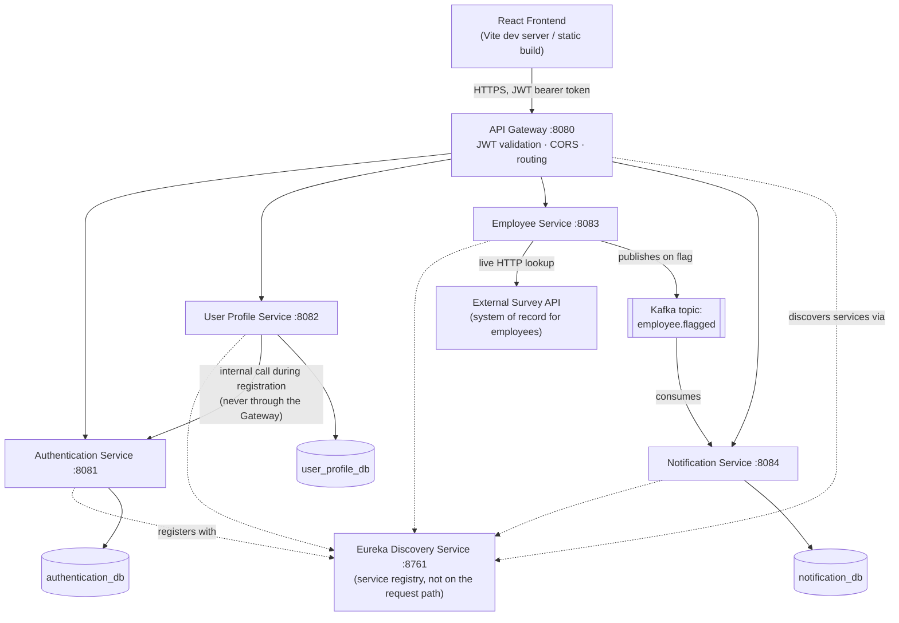
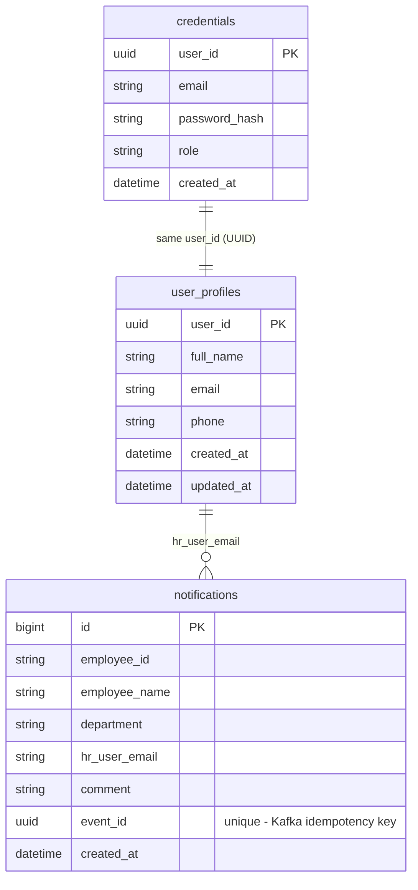
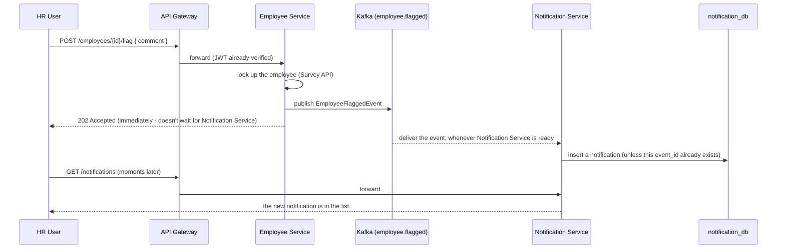

# Attrition Analyzer

## 1. Project Overview

Attrition Analyzer is an HR analytics application. It exists to answer one question HR teams usually can't answer without a spreadsheet and a lot of manual digging: *which employees are showing signs of leaving, and where in the organization is that concentrated?*

Instead of storing employee data itself, the application reads employee records from an external **Survey API** — the workforce data already lives somewhere, and Attrition Analyzer's job is to make it *usable*: searchable, browsable, and broken down across the dimensions that actually explain attrition (department, job role, compensation, demographics, work-life balance, career progression). On top of that, HR users can flag a specific employee they're concerned about with a note, and that turns into a notification the rest of the HR team can see.

There are exactly two kinds of users:

- **Guest** — anyone who opens the site without an account. A guest can see a limited attrition summary (department and job role breakdowns) and can register to become an HR user. That's it — no employee names, no search, no notifications.
- **HR User** — a registered, logged-in user. Full access: browse and search every employee record, view attrition broken down six different ways, flag employees of concern, and manage the resulting notifications.

The intended path is **Guest → Register → HR User** — there's no separate admin role, no approval step, no tiers beyond those two.

---

## 2. How the System Works

At a high level, every request from the browser goes through one door:

```
React Frontend → API Gateway → the right microservice
```

The frontend never talks to `authentication-service`, `employee-service`, or any other backend service directly — it only ever calls the API Gateway on port `8080`, and the Gateway decides which service should handle the request based on the URL path. This is what lets each service evolve independently: the frontend has one address to remember, and the Gateway is the only place that needs to know where everything else lives.

**How the Gateway finds "everything else"** is Eureka's job. Every backend service registers itself with the Eureka Discovery Service on startup ("I'm `employee-service`, I'm alive, here's my address"). The Gateway doesn't hardcode `employee-service`'s IP or port anywhere — it asks Eureka, "who's running as `employee-service` right now?" and routes there. This matters in Docker, where container IPs aren't predictable, and it means you could scale any service to multiple instances without touching the Gateway's configuration.

**Each service owns its own data — nobody reaches into another service's database.** Authentication Service is the only thing that can read or write the `credentials` table; if User Profile Service needs something from it, it asks Authentication Service over the network, it doesn't query the table directly. This is the difference between a "microservices" architecture and just a distributed monolith with shared tables — ownership boundaries are enforced by *who has the database connection*, not just by convention.

**Employee data is a special case: there is no database for it at all.** Employee Service is a pass-through to the external Survey API. Every time you view employees, search, or ask for an attrition breakdown, Employee Service calls the Survey API live and shapes the response — it never persists a copy. This keeps the application from ever going stale relative to the Survey API, at the cost of Employee Service being unable to function if the Survey API is unreachable.

**Communication is synchronous almost everywhere, with exactly one asynchronous exception.** The frontend calling the Gateway, the Gateway calling a service, one service calling another (like User Profile calling Authentication during registration) — all of that is plain HTTP, request-in, response-out, because the caller needs an immediate answer before it can do anything else. The one place this changes is flagging an employee: when an HR user flags someone, Employee Service doesn't call Notification Service directly. It publishes a message to **Kafka** and moves on, and Notification Service picks that message up whenever it gets to it. This decouples the two services — Employee Service doesn't need to know Notification Service exists, doesn't wait on it, and isn't broken if Notification Service is temporarily down when the flag happens.

---

## 3. Architecture



**Why each piece exists:**

- **API Gateway** — the single front door. Without it, the frontend would need to know the address of every microservice individually, and every service would need to implement its own CORS and JWT-checking logic. Centralizing that in one place means the frontend has one thing to configure, and security policy lives in one file instead of six.
- **Eureka Discovery Service** — the address book. It isn't on the path of any real request; it just answers "where is service X right now?" so the Gateway can route without hardcoded addresses.
- **Authentication Service** — the only thing that knows how to verify a password and issue proof of identity (a JWT). Isolating this means a password hash only ever exists in one database, touched by one codebase.
- **User Profile Service** — owns *who* someone is (name, phone) as distinct from *how they log in*. Splitting identity (Authentication) from profile (User Profile) means either can change independently — e.g., adding profile fields later never touches credential logic.
- **Employee Service** — the translation layer between the external Survey API's data shape and what this application actually needs, plus all the attrition math. It has no database because the Survey API already *is* the database.
- **Notification Service** — owns the "HR flagged this employee" record. It's decoupled from Employee Service via Kafka specifically so that flagging an employee is fast and doesn't fail just because Notification Service is busy or restarting.

**How services actually talk to each other**, summarized:

| From | To | How | Why |
|---|---|---|---|
| Frontend | API Gateway | REST over HTTP, JWT in `Authorization` header | Single entry point |
| API Gateway | any backend service | REST, resolved via Eureka | Simple request/response, no benefit to async here |
| User Profile Service | Authentication Service | REST (Feign client), direct service-to-service, bypassing the Gateway | Registration needs an immediate yes/no on whether the credential was created |
| Employee Service | Survey API | REST | It's a third-party HTTP API, not something we control |
| Employee Service | Notification Service | **Kafka**, not REST | The only place a fire-and-forget async handoff makes sense — see [Kafka](#7-kafka) |

---

## 4. User Workflows

This is what actually happens, step by step, for the things a person does with this application.

**Guest visits the application.** No login. The landing page calls the Gateway's `GET /employees/analysis/department` and `.../job-role` endpoints, which are the only two routes the Gateway allows through without a token. Everything else — the employee directory, employee details, the full dashboard, notifications — is behind a login wall; a guest who tries to navigate there directly is redirected to the login page.

**HR registration.** The guest fills in name, email, password, and (optionally) phone, and submits. This hits `POST /users/register` on User Profile Service, which first calls Authentication Service internally to create the credential (hashed password, a new user ID, and role `HR`). Once that succeeds, User Profile Service saves the profile (name, phone) under that same user ID. Two databases, one user, tied together by a shared UUID — never by re-sending the password. The registration endpoint itself doesn't return a token, so the frontend immediately logs the new user in with the credentials they just typed, so registering feels like one seamless step.

**HR login / JWT.** `POST /auth/login` checks the email/password against `authentication_db`, and if they match, issues a **JWT** — a signed token containing the user's ID, email, and role, valid for one hour by default. The frontend stores this token and attaches it as `Authorization: Bearer <token>` on every request from then on. No service keeps a server-side "logged in" list — the token itself *is* the proof, which is why nothing needs to be cleaned up when a session ends.

**Viewing employees.** `GET /employees` goes to Employee Service, which calls the Survey API, maps the external response into this application's own employee shape, and returns it. The frontend never sees the Survey API's raw format.

**Searching an employee.** The Gateway route supports `GET /employees?property=X&value=Y` for an exact match on one field, server-side. The employee directory page in the frontend actually fetches the full list once and filters client-side by name, ID, or job role as you type — faster for a human browsing a list they already have in front of them, and it still calls the real endpoint to get that list in the first place.

**Viewing employee details.** `GET /employees/{id}` — same Survey API round trip, scoped to one record. A missing ID returns a clean 404 rather than an error page.

**Attrition analysis.** Six endpoints, one per dimension (department, job role, compensation, demographics, work-life balance, career progression). Each one asks Employee Service to fetch the full employee list from the Survey API and group-and-count it on the fly — there's no cached or pre-computed table anywhere; the numbers are always fresh as of the moment you asked.

**Flagging an employee.** From an employee's detail page, an HR user writes a short comment and submits. This is where the flow leaves plain REST — see [Kafka](#7-kafka) for exactly what happens next. The short version: it becomes a notification, asynchronously, usually within a second or two.

**Viewing and deleting notifications.** `GET /notifications` returns only the notifications belonging to the logged-in user (matched by their email). `DELETE /notifications/{id}` removes one — but only if it belongs to you; trying to delete someone else's notification fails.

**Profile update.** `GET /users/me` and `PUT /users/me` view and update your own name/phone. Email isn't editable through this endpoint — it's the identifier tied to your credential, so changing it is deliberately out of scope here.

**Logout / session expiry.** Logging out simply discards the token in the browser — there's nothing to tell the server, because a JWT can't be "revoked" without adding server-side state the rest of the system deliberately avoids. Session expiry works the same way in reverse: the frontend reads the token's expiry time and automatically logs you out when it passes, and if any request ever comes back `401` (e.g., the token was tampered with, or expired mid-session), the frontend treats that as "you're logged out" and sends you back to the login page.

---

## 5. Microservices

### Discovery Service

**Responsibility:** the Eureka service registry. Every other backend service registers itself here on startup and periodically confirms it's still alive.

**Why it exists:** so nothing in the system has to hardcode another service's network address. In Docker, container addresses aren't stable across restarts — without a registry, the Gateway's configuration would need to change every time a service's IP changed.

**APIs:** none meant for application use — it exposes Eureka's own dashboard at `http://localhost:8761`, useful for confirming everything registered correctly.

**Database:** none.

**Talks to:** nothing actively — every other service talks *to* it.

### API Gateway

**Responsibility:** the single entry point for the frontend. Validates JWTs, applies CORS rules, and routes each request to the correct backend service by path prefix.

**Why it exists:** centralizes cross-cutting concerns (auth, CORS, routing) so individual services don't each reimplement them, and gives the frontend exactly one address to know about.

**Routing rules:**

| Path prefix | Routed to |
|---|---|
| `/auth/**` | Authentication Service |
| `/users/**` | User Profile Service |
| `/employees/**` | Employee Service |
| `/notifications/**` | Notification Service |

**Auth enforcement:** every route requires a valid JWT *except* `POST /auth/login`, `POST /users/register`, `POST /auth/reset-password/**`, `GET /employees/analysis/**` (the Guest-visible attrition summary), and the actuator health endpoint. A request to any other route without a valid token gets a `401` before it ever reaches a backend service.

**Database:** none — it's purely a router.

**Talks to:** all four business services, resolved through Eureka.

### Authentication Service

**Responsibility:** owns credentials — email, hashed password, role — and is the only service that can issue or verify a JWT's signature.

**Why it exists:** isolating "how do you prove who you are" from "what's your name/phone" means a password hash lives in exactly one place, and changing anything about profile data can never accidentally touch login logic.

**APIs:**

| Method | Path | Auth | Purpose |
|---|---|---|---|
| POST | `/auth/login` | No | Verify credentials, return a JWT |
| POST | `/auth/logout` | Yes | Confirms the caller held a valid token; nothing to invalidate server-side |
| POST | `/auth/reset-password/request` | No | Start a password reset |
| POST | `/auth/reset-password/confirm` | No | Complete a password reset |

There's also an internal-only endpoint, `POST /internal/credentials`, used exclusively by User Profile Service during registration — it's never reachable through the Gateway.

**Database:** `authentication_db` — one table, `credentials` (user ID, email, hashed password, role, created-at).

**Talks to:** nothing outbound; User Profile Service calls it, directly, service-to-service.

### User Profile Service

**Responsibility:** owns the human-facing side of an HR account — full name, phone — and orchestrates registration.

**Why it exists:** separates *identity* (Authentication) from *profile* (this service), the same reasoning as above, seen from the other side.

**APIs:**

| Method | Path | Auth | Purpose |
|---|---|---|---|
| POST | `/users/register` | No | Create a credential (via Authentication) + a profile, in that order |
| GET | `/users/me` | Yes | View your own profile |
| PUT | `/users/me` | Yes | Update your own name/phone |

**Database:** `user_profile_db` — one table, `user_profiles` (user ID, full name, email, phone, created-at, updated-at).

**Talks to:** Authentication Service, directly (not through the Gateway), to create the credential half of a new registration before saving the profile half.

### Employee Service

**Responsibility:** the only place that talks to the external Survey API. Handles employee listing, search, detail lookup, all six attrition breakdowns, and publishing the "flagged" event.

**Why it exists:** every other service should be able to treat "get me employee data" as a simple internal API call, without knowing or caring that the real data lives in a third-party system with its own shape and quirks.

**APIs:**

| Method | Path | Auth | Purpose |
|---|---|---|---|
| GET | `/employees` | Yes | List all employees |
| GET | `/employees?property=X&value=Y` | Yes | Exact-match search on one field |
| GET | `/employees/{id}` | Yes | One employee's details |
| POST | `/employees/{id}/flag` | Yes | Flag an employee with a comment → publishes to Kafka |
| GET | `/employees/analysis/{dimension}` | department/job-role: **No** · others: Yes | Attrition grouped by one of six dimensions |

**Database:** none — everything is fetched live from the Survey API on every request.

**Talks to:** the Survey API (synchronously, for every read), and Kafka (asynchronously, only when an employee is flagged).

### Notification Service

**Responsibility:** owns the record of "an HR user flagged this employee, here's why," and is the consumer side of the Kafka flow.

**Why it exists:** flagging needs somewhere durable to land that isn't Employee Service (which deliberately has no database) and isn't tightly coupled to the moment the flag happened.

**APIs:**

| Method | Path | Auth | Purpose |
|---|---|---|---|
| POST | `/notifications` | Yes | Create a notification directly (not currently used by the frontend, which only creates them via flagging — see below) |
| GET | `/notifications` | Yes | Your own notifications |
| DELETE | `/notifications/{id}` | Yes | Delete your own notification |

**Database:** `notification_db` — one table, `notifications` (id, employee id/name/department, the HR user's email, the comment, a unique event ID, created-at).

**Talks to:** Kafka, as a consumer of the `employee.flagged` topic.

### Survey API

Not part of this repository — an external system this project assumes exists and is reachable. It's the actual system of record for employee data; Employee Service is a thin, purpose-built client in front of it. You need your own instance running (from the case study this project is based on) for anything employee-related to work.

---

## 6. Database Architecture



**Why three separate databases instead of one shared one:** each service is the *only* thing that ever reads or writes its own tables. That's what actually makes them independent services rather than one application split across files — you could change `notifications`' schema tomorrow without coordinating with Authentication Service at all, because it has no way to know or care that table exists. The trade-off is that `credentials` and `user_profiles` share a concept (the same person) without sharing a database — they're linked only by both using the same `user_id` UUID, generated once by Authentication Service at registration and handed to User Profile Service to reuse. Neither database has a foreign key into the other; the relationship is enforced by application code, not by the database.

**Employee Service has no database at all** — the Survey API *is* its data store. This isn't a simplification for the sake of the project; it reflects a real architectural choice: employee data changes outside this application's control, so caching it would mean building a sync mechanism nobody asked for.

---

## 7. Kafka

This is the one place in the system where a request doesn't get an immediate, synchronous answer all the way through — and it's worth understanding as a story, not just a config block.

**The scenario:** an HR user is looking at an employee's detail page, sees something concerning (excessive overtime, no promotion in years, whatever it is), and writes a one-line note: *"Flight risk — discuss retention."* They click **Flag Employee**.



**Why this is asynchronous instead of Employee Service just calling Notification Service directly:** if it were a direct call, flagging an employee would fail (or hang) any time Notification Service was slow, restarting, or down — for a feature that's fundamentally "leave a note for later," that's a bad trade. With Kafka, Employee Service publishes the event and immediately tells the HR user "got it" — Notification Service processes it independently, and if it's briefly unavailable, the event is just waiting on the topic when it comes back.

**The event itself** (`EmployeeFlaggedEvent`), published as JSON to the topic `employee.flagged`:

```json
{
  "eventId": "a UUID, generated fresh for every flag action",
  "employeeId": "the employee's business ID",
  "employeeName": "string",
  "department": "string",
  "comment": "what the HR user wrote",
  "hrUserEmail": "who flagged them",
  "flaggedAt": "timestamp"
}
```

**Producer:** Employee Service, on every `POST /employees/{id}/flag`.
**Consumer:** Notification Service, in a dedicated consumer group, listening continuously.

**Idempotency:** `eventId` is a unique column on the `notifications` table. If the same event somehow gets delivered twice (Kafka's delivery guarantee is "at least once," not "exactly once" — redelivery can happen after a consumer restart, for example), the second insert attempt just fails the uniqueness check and is silently ignored rather than creating a duplicate notification.

---

## 8. Authentication & Authorization

**The chain, end to end:** register → credential stored → log in → JWT issued → JWT sent on every request → Gateway checks it → request reaches a protected service.

1. **Registration** creates two things under one shared user ID: a *credential* (email + hashed password + role, in Authentication Service) and a *profile* (name + phone, in User Profile Service). The password is hashed once, on the way in, and the plain text is never stored or logged anywhere.
2. **Login** compares the submitted password against the stored hash. If it matches, Authentication Service builds a **JWT** — a token that's cryptographically signed so nobody can forge or alter it without knowing the signing secret — and hands it back.
3. **What's inside the token:** the user's ID, their email, their role, and an expiry time (`exp`). Nothing else. The token isn't looked up anywhere when it's used — its signature alone proves it's genuine and unmodified.
4. **Every request after that** carries the token in an `Authorization: Bearer <token>` header. The Gateway verifies the signature and checks the expiry before letting the request through to a backend service — an expired, tampered, or missing token on a protected route gets a `401` at the Gateway, before any business logic runs.
5. **Expiry** defaults to one hour. There's no server-side session to "log out of" — the token is simply valid until its expiry timestamp passes, at which point it stops working on its own. The frontend watches that expiry client-side and logs you out proactively, plus reacts to any `401` as "your session ended."

**Guest vs. HR, in practice:** there's no "Guest role" stored anywhere — a Guest is just someone with no token at all. The Gateway allows exactly five routes through without one: login, registration, password reset, health checks, and the two Guest-visible attrition endpoints (department and job role). Every other route — the full employee directory, employee details, the other four attrition breakdowns, flagging, and all of notifications — requires a valid token. There's currently only one role a token can carry, `HR`; the system doesn't yet distinguish between different *kinds* of HR user.

---

## 9. Setup & Installation

Commands below are PowerShell (this project is commonly developed on Windows); a `bash`/macOS/Linux equivalent is a one-line change (`./mvnw` instead of `.\mvnw.cmd`, `cp` instead of `Copy-Item`).

### Prerequisites

| Tool | Needed for |
|---|---|
| JDK 21 | Building/running any backend service |
| Node.js (LTS) + npm | The frontend |
| Docker Desktop | Running the full backend stack (3× MySQL, Kafka, all 6 services) |
| A running Survey API instance | Anything employee-related — see below |

You don't need Maven installed separately — each service ships its own wrapper (`mvnw.cmd`).

### 1. Clone

```powershell
git clone <this-repo-url>
cd attrition-analyzer
```

### 2. Configure environment

```powershell
Copy-Item .env.example .env
notepad .env   # fill in every value - see Configuration below
```

### 3. Have a Survey API reachable

Employee Service has no data of its own — it expects a Survey API at `http://localhost:3232` by default (or `http://host.docker.internal:3232` when Employee Service itself runs in Docker). If yours runs elsewhere, you'll adjust `docker-compose.yml`'s `employee-service` entry in step 5.

### 4. Build every backend service's jar

```powershell
foreach ($svc in "discovery-service","api-gateway","authentication-service","user-profile-service","employee-service","notification-service") {
  Push-Location $svc
  .\mvnw.cmd -q -DskipTests package
  Pop-Location
}
```

### 5. Start the backend

```powershell
docker compose up -d --build
```

This builds all six service images from the jars you just packaged, starts the three MySQL containers and Kafka, waits for their health checks, then starts the services that depend on them. First-time startup can take a minute or two while MySQL and Kafka initialize.

### 6. Verify it's up

```powershell
docker compose ps
```

All ten containers should show as running (the three databases and Kafka as `healthy`). Then:

- Eureka dashboard: http://localhost:8761 — you should see `API-GATEWAY`, `AUTHENTICATION-SERVICE`, `USER-PROFILE-SERVICE`, `EMPLOYEE-SERVICE`, and `NOTIFICATION-SERVICE` all registered.
- Gateway health: `curl http://localhost:8080/actuator/health`

### 7. Start the frontend

```powershell
cd frontend
npm install
npm run dev
```

Open the URL it prints (Vite's default is `http://localhost:5173`). No configuration needed — it talks to the Gateway at `http://localhost:8080` by default.

### 8. Open the application

You should land on the public homepage with a working Guest attrition summary. Register an account to explore the rest.

---

## 10. Running / Stopping

| Action | Command |
|---|---|
| Start everything (after images are built once) | `docker compose up -d` |
| Rebuild + start (after code changes — see note below) | `docker compose up -d --build` |
| Status of every container | `docker compose ps` |
| Tail logs for one service | `docker compose logs -f <service-name>` |
| Restart just one service | `docker compose restart <service-name>` |
| Stop everything, keep data | `docker compose down` |
| Stop everything and wipe all database data | `docker compose down -v` |

**Important:** the Dockerfiles only *package* an already-built jar — they don't run Maven. If you change a service's code, you must rebuild its jar (`.\mvnw.cmd -q -DskipTests package` in that service's folder) before `docker compose up -d --build <service-name>` will pick up the change.

The frontend isn't managed by Docker Compose — stop it the normal way (Ctrl+C in its terminal).

---

## 11. Configuration

All of this lives in `.env` at the repo root (copied from `.env.example`, which is committed with blank placeholders — real values are never committed).

| Variable | Controls |
|---|---|
| `MYSQL_ROOT_PASSWORD` | Root password shared by the `authentication-db` and `user-profile-db` containers |
| `AUTH_DB_USERNAME` / `AUTH_DB_PASSWORD` | App-level login Authentication Service uses for `authentication_db` |
| `PROFILE_DB_USERNAME` / `PROFILE_DB_PASSWORD` | App-level login User Profile Service uses for `user_profile_db` |
| `NOTIFICATION_DB_ROOT_PASSWORD` | Root password for the `notification-db` container (kept separate from the other two on purpose) |
| `NOTIFICATION_DB_USERNAME` / `NOTIFICATION_DB_PASSWORD` | App-level login Notification Service uses for `notification_db` |
| `JWT_SECRET` | The key used to sign and verify every JWT. **Must be the same value across every service** — Authentication Service signs with it, everyone else verifies with it. Use a long random string; never reuse a demo value in anything real |

One more variable exists with a safe built-in default, so it's optional: `JWT_EXPIRATION_MS` (how long a session lasts before expiring — defaults to `3600000`, one hour).

The frontend needs no environment configuration for local development — it assumes the Gateway is at `http://localhost:8080`. To point it elsewhere, set `VITE_API_BASE_URL` in a `frontend/.env.local` file (Vite loads this automatically; it's git-ignored).

---

## 12. Ports

| What | Port |
|---|---|
| Frontend (Vite dev server) | 5173 |
| API Gateway | 8080 |
| Authentication Service | 8081 |
| User Profile Service | 8082 |
| Employee Service | 8083 |
| Notification Service | 8084 |
| Eureka Discovery Service | 8761 |
| Kafka broker | 9092 |
| `notification-db` (MySQL) | 3307 |
| `authentication-db` (MySQL) | 3308 |
| `user-profile-db` (MySQL) | 3309 |
| Survey API (external, not part of this repo) | 3232 (default assumption) |

---

## 13. API Reference

The frontend — and you, testing manually — should only ever call the Gateway on `:8080`. All paths below are relative to `http://localhost:8080`.

**Authentication**

| Method | Endpoint | Auth | Purpose |
|---|---|---|---|
| POST | `/auth/login` | No | Log in, get a JWT |
| POST | `/auth/logout` | Yes | Confirms a valid session; no server-side effect |
| POST | `/auth/reset-password/request` | No | Start a password reset |
| POST | `/auth/reset-password/confirm` | No | Complete a password reset |

**User Profile**

| Method | Endpoint | Auth | Purpose |
|---|---|---|---|
| POST | `/users/register` | No | Create an HR account |
| GET | `/users/me` | Yes | View your profile |
| PUT | `/users/me` | Yes | Update your name/phone |

**Employee**

| Method | Endpoint | Auth | Purpose |
|---|---|---|---|
| GET | `/employees` | Yes | List employees |
| GET | `/employees?property=X&value=Y` | Yes | Search by one field |
| GET | `/employees/{id}` | Yes | One employee's detail |
| POST | `/employees/{id}/flag` | Yes | Flag an employee (→ Kafka → notification) |
| GET | `/employees/analysis/department` | **No** | Attrition by department |
| GET | `/employees/analysis/job-role` | **No** | Attrition by job role |
| GET | `/employees/analysis/compensation` | Yes | Attrition by compensation |
| GET | `/employees/analysis/demographics` | Yes | Attrition by demographics |
| GET | `/employees/analysis/work-life-balance` | Yes | Attrition by work-life balance |
| GET | `/employees/analysis/career-progression` | Yes | Attrition by career progression |

**Notifications**

| Method | Endpoint | Auth | Purpose |
|---|---|---|---|
| POST | `/notifications` | Yes | Create a notification directly (bypassing the flag/Kafka flow) |
| GET | `/notifications` | Yes | Your own notifications |
| DELETE | `/notifications/{id}` | Yes | Delete your own notification |

---

## 14. Testing

Each backend service is its own Maven project, so each has its own test suite, run from its own folder:

```powershell
cd <service-directory>
.\mvnw.cmd test
```

What's actually covered, per service:

- **Discovery Service** — just confirms the application context starts.
- **API Gateway** — JWT parsing/validation and the security filter chain (which routes require a token and which don't).
- **Authentication Service** — login, the internal credential-creation endpoint, password reset, JWT issuance, and the security chain. These run against an in-memory H2 database, not a live MySQL, so they don't need Docker.
- **User Profile Service** — registration (including its internal call to Authentication), profile view/update, and the security chain. Also H2-backed, no Docker required.
- **Employee Service** — the Survey API response mapping, search, and the attrition aggregation math (grouping/counting logic). One additional integration test (`SurveyApiClientIT`) requires a real, reachable Survey API and isn't wired into the standard `test` run — it exists for someone to run manually against a live Survey API if they need to verify that integration specifically.
- **Notification Service** — creating, listing, and deleting notifications, plus the Kafka consumer and its duplicate-event handling.

**Frontend checks:**

```powershell
cd frontend
npm run build   # type-checks the whole app and produces a production build
npm run lint    # static analysis
```

There's no frontend unit/component test suite yet — correctness there is verified by type-checking, linting, and the manual end-to-end flow below.

---

## 15. Complete End-to-End Test

A realistic sequence to run through after a fresh startup, to confirm the whole system actually works together:

1. Open the app while logged out — confirm the Guest attrition summary loads on the homepage.
2. Try to navigate straight to the employee directory or dashboard — confirm you're redirected to log in.
3. Register a new account — confirm you land inside the app already logged in.
4. Open the dashboard — confirm all six attrition breakdowns and your (empty) notifications list load.
5. Open the employee directory — confirm real employee records appear, and that typing in the search box narrows them.
6. Open one employee's detail page.
7. Submit **Flag Employee** with a comment.
8. Go back to the dashboard (or wait a moment) — confirm the flagged employee now shows up as a notification.
9. Delete that notification — confirm it disappears and doesn't come back on refresh.
10. Go to your profile, change your name or phone, save, refresh the page — confirm the change persisted.
11. Log out — confirm you're back on the public homepage and protected pages redirect to login again.

If every step above works, the frontend, the Gateway, all four business services, all three databases, and Kafka are all correctly wired together.

---

## 16. Troubleshooting

| Symptom | Diagnose / fix |
|---|---|
| A service exits immediately, error mentions `JWT_SECRET` | `.env` is missing or blank — `Copy-Item .env.example .env`, fill it in, `docker compose up -d` again |
| `authentication-service` / `user-profile-service` / `notification-service` won't start right after first `docker compose up -d` | Cold-start race with MySQL — run `docker compose ps` and wait for the databases to show `(healthy)`, usually under two minutes |
| Browser console shows a CORS error | You're calling a service port directly instead of the Gateway on `:8080` — CORS is only configured there |
| Logged-in requests suddenly return `401` | Token expired (default: one hour) — log in again |
| Flagging an employee succeeds but no notification ever shows up | `docker compose logs kafka` and `docker compose logs notification-service` — most often a stale `notification-db` volume from earlier testing; `docker compose down`, then `docker compose down -v` to reset it, then start again |
| Code changes don't show up after rebuilding Docker | You rebuilt the container but not the jar — run `.\mvnw.cmd -q -DskipTests package` in that service's folder first, *then* `docker compose up -d --build <service>` |
| Employee-related pages error out or show nothing | The Survey API isn't reachable at the configured address — confirm it's running and check `survey-api.base-url` in `employee-service`'s config |
| Want a totally clean slate | `docker compose down -v` (wipes all database data), rebuild jars, `docker compose up -d --build` |

Handy one-liners:

```powershell
docker compose ps
docker compose logs -f <service-name>
curl http://localhost:8080/actuator/health
```

---

## 17. Project Development Plan

The project was built in phases, each one unlocking the next:

1. **Foundation** — Eureka and the API Gateway stood up first, with every service starting as an empty, health-checked skeleton that could register itself. Nothing worked yet; the point was proving the skeleton held together.
2. **Authentication** — credentials, login, JWT issuance, password reset, and session expiry, all in isolation, before anything else depended on them.
3. **User Profile** — registration completed the loop (credential + profile together), plus viewing and updating your own profile.
4. **Employee Service** — the Survey API integration, employee listing, search, and detail views.
5. **Attrition Analysis** — the six breakdowns, built directly on top of the employee data already flowing through Employee Service.
6. **Notifications & Kafka** — flagging an employee, the asynchronous handoff to Notification Service, and viewing/deleting notifications.
7. **Guest Experience** — carving out the narrow, unauthenticated slice of attrition data guests are allowed to see, once there was real attrition data to show them.
8. **Frontend** — a React interface wired to every real endpoint above, giving all of the preceding phases an actual interface to be used through.

Each phase was built to be independently testable before the next one started, which is why the test suites above are organized the same way — one focused suite per service, rather than one giant end-to-end suite standing in for all of them.
