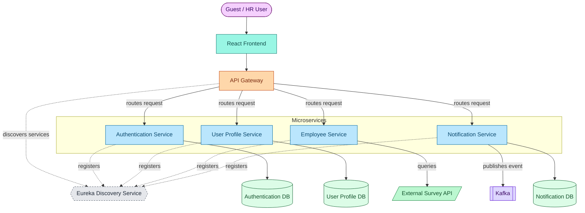
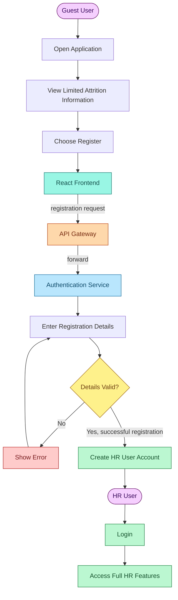
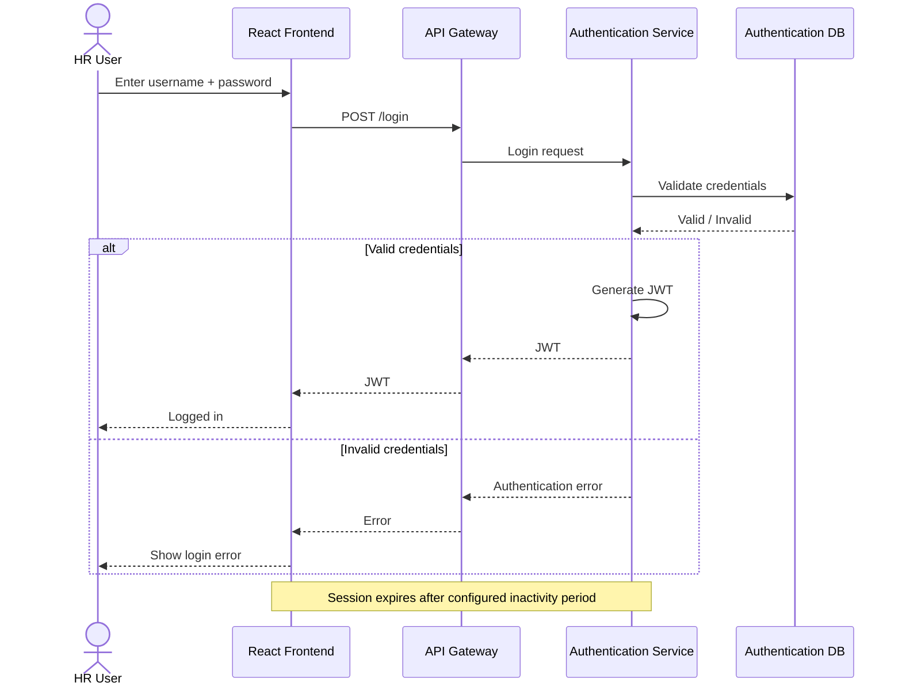
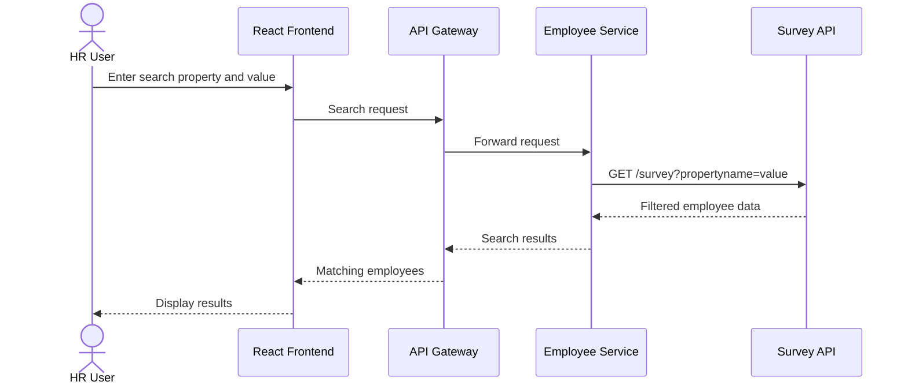
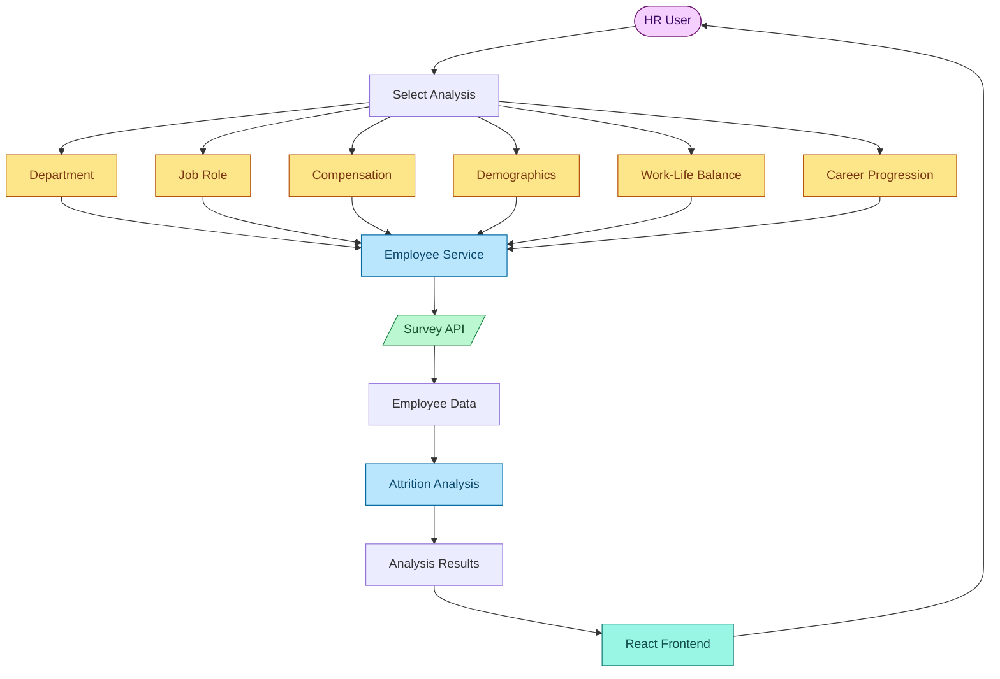
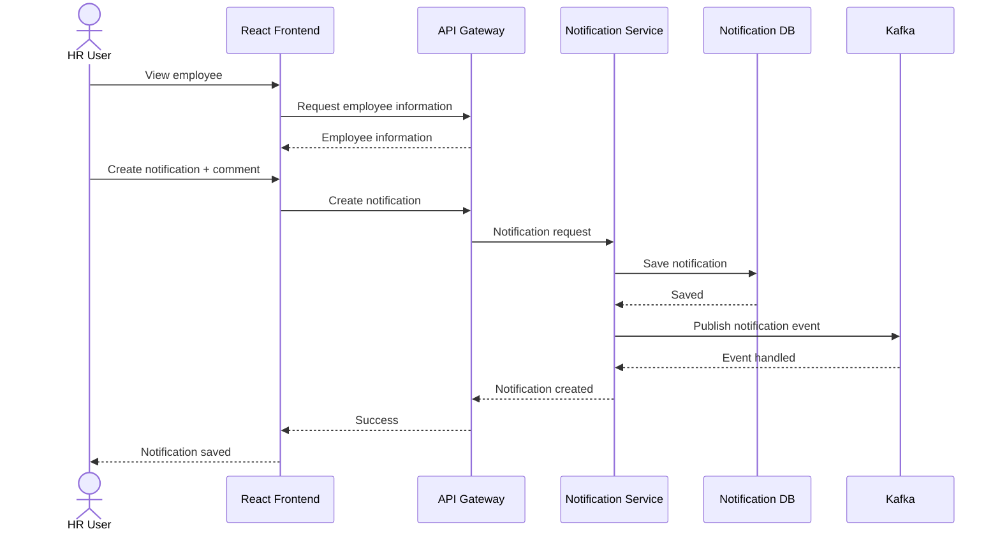
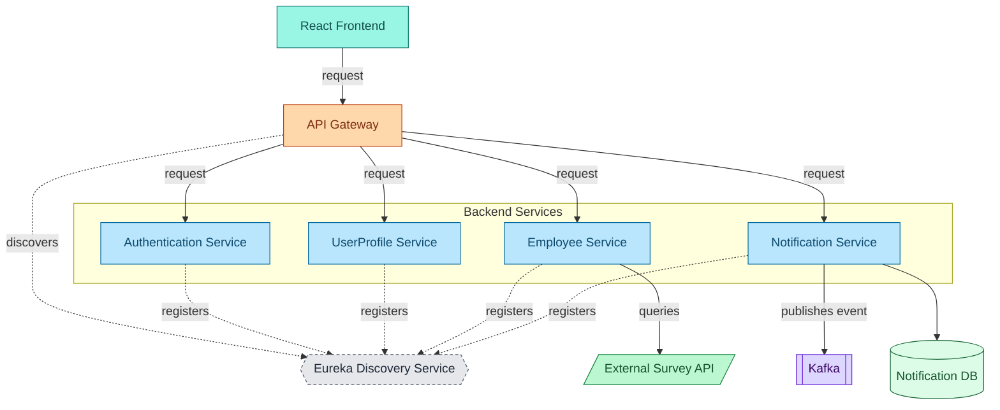
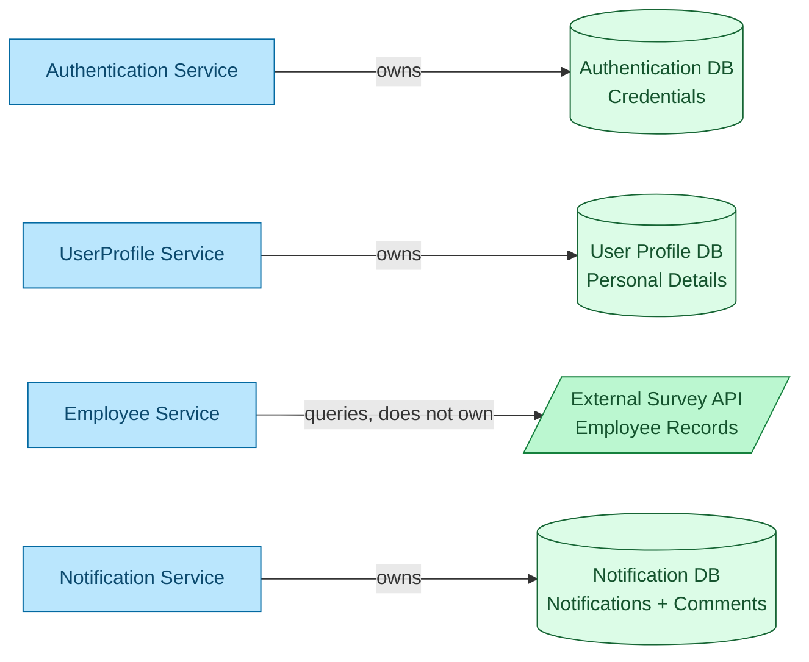
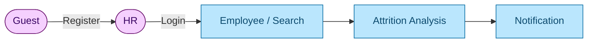

# Attrition Analyzer — Project Flows

This document visualizes the Attrition Analyzer system using diagrams rendered directly from Markdown (Mermaid), so the flows stay readable straight from the GitHub repository. It covers the system architecture, the guest → HR user journey, authentication, employee search, attrition analysis, notifications, service discovery, and database ownership.

These diagrams are derived from the reference designs in `docs/diagrams/` (numbered PNGs `01`–`09`), which remain the authoritative source. This file is a text-based, versionable companion to those images — it does not introduce new functionality, services, or architecture beyond what the reference diagrams show.

**Reading the diagrams:** solid arrows represent an actual runtime request/data flow; dotted arrows represent service registration/discovery with Eureka, which is never itself a hop in a request path; cylinder shapes are databases; the parallelogram shape is an external system (the Survey API).

---

## 1. System Overview

*Based on `03_System_Architecture.png`.*

Eureka is drawn off to the side and connected only with dotted "registers / discovers" edges — it is a registry that services and the gateway consult, not a stop on the request path itself.

---

## 2. Guest Registration

*Based on `02_RegistrationFlow.png`.*

Only two user types exist in the system: **Guest** and **HR**. A Guest who completes registration becomes an HR user.

---

## 3. Login Flow

*Based on `06_LoginFlow.png`.*

---

## 4. Employee Search

*Based on `04_SearchEmployeeFlow.png`.*

Search stays a lightweight pass-through: the frontend's search request is forwarded through the existing Employee Service straight to the Survey API — there is no dedicated search microservice or additional infrastructure.

---

## 5. Attrition Analysis

*Based on `05_AttritionAnalysisFlow.png`.*

No analysis categories beyond the six shown above (Department, Job Role, Compensation, Demographics, Work-Life Balance, Career Progression) are implied.

---

## 6. Notification Flow

*Based on `07_CreateNotificationFlow.png`.*

---

## 7. Service Discovery

*Based on `08_ServiceDiscovery.png`.*

The dashed hexagon makes it visually explicit: Eureka sits beside the request path (registration/discovery only) rather than inside it — solid arrows are the only ones carrying actual traffic.

---

## 8. Database Ownership

*Based on `09_DatabaseOwnership.png`.*

Each service owns exactly one database, with one exception: Employee Service holds no database of its own — employee records live in the external Survey API, which it queries rather than owns. No tables, schemas, or databases beyond these four are implied.

---

## 9. Complete User Journey

A concise, user-focused summary of the end-to-end journey through the system.

